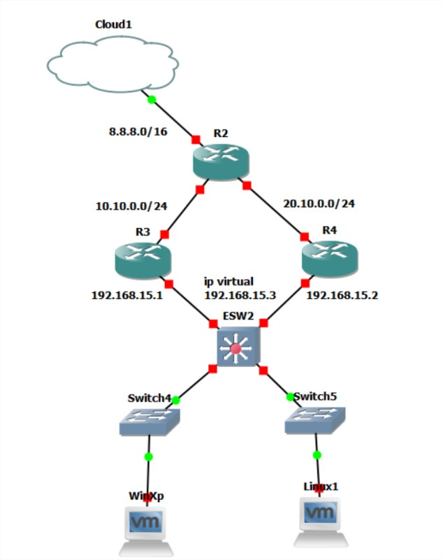

# Manual Tecnico

## Datos
- Grupo 31
## Topología empleada
### Topología 1

En esta topología podemos ver que se emplea el uso de lo que es un router para la configuracion de las ip proporcionadas para las diferentes vlans, a su vez el EtherSwitch nos sirve para configurar las vlans y los switch que segun el puerto se configuran las vlan que proporciona cada puerto del switch a nuestros host

### Topología 2

En esta topologia compuesta

