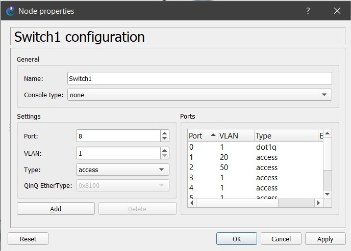
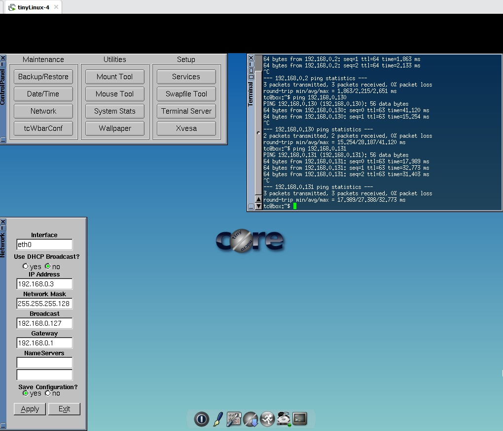

# Manual Tecnico

## Datos
- Grupo 31
## Topología empleada
### Topología 1

En esta topología podemos ver que se emplea el uso de lo que es un router para la configuracion de las ip proporcionadas para las diferentes vlans, a su vez el EtherSwitch nos sirve para configurar las vlans y los switch que segun el puerto se configuran las vlan que proporciona cada puerto del switch a nuestros host

### Topología 2

En esta topologia compuesta por 3 routers y por un EtherSwitch que le proporciona direcciones IP a nuestros Host, estas IP se configuran en los router, a su vez en el EtherSwitch se configurarían las vlans por las cuales se permitira dar una dirección IP a los host

## Tabla VLSM

Esta tabla es un calculo optimizado de las IP que podemos utilizar para nuestras subredes así como tambien la mascara de red, el broadcast, etc.

## Configuracion EtherSwitch 1

En esta configuraremos nuestras <strong>VLANS</strong> por medio del comando vlan # y seguido de este agregariamos el nombre de cada Vlan por medio del comando name *nombre*

Ahora posteriormente procederiamos a configurar los puertos de nuestro etherswitch como modo trunk, este modo suele usarse muchas veces para unir los switches de acceso y permitir las vlans que son necesarias

## Router 1

Ahora bien ya dentro del router 1 lo que procederiamos a realizar es la configuracion de las diferentes <strong>subInterfaces</strong> por medio del comando int f#/#.# donde estos corresponden al numero de los puertos de fastEthernet y el de la vlan como el de subnet.
Luego ya dentro de este definiriamos las direcciones IP y las Mask que vamos a utilizar para nuestras respectivas VLANS

## Switches

Por ultimo configuraremos los puertos de nuestros switches indicando que el puerto 0 estará conectado a un EtherSwitch de modo trunk mientras que los puertos 1 y 2 corresponderan a ser de tipo access y le asignaremos a cada uno una vlan en especifico la cual nos servira para poder asignarle una direccion ip a nuestros host.

## Hosts

Una vez realizada toda la configuracion anterior se procede a configurar cada host, para ellos lo que se hace es configurar cada dirección ip que va a corresponder a nuestros respectivos host, le indicaremos la mascara de red, que fue la misma que configuramos en el Router, y seguido a esto le indicaremos los gateway que son las direcciones ip que le asignamos a cada subinterfaz de nuestros routers, ademas de ello indicaremos el broadcast los cuales estan establecidos por medio de la tabla VLSM

